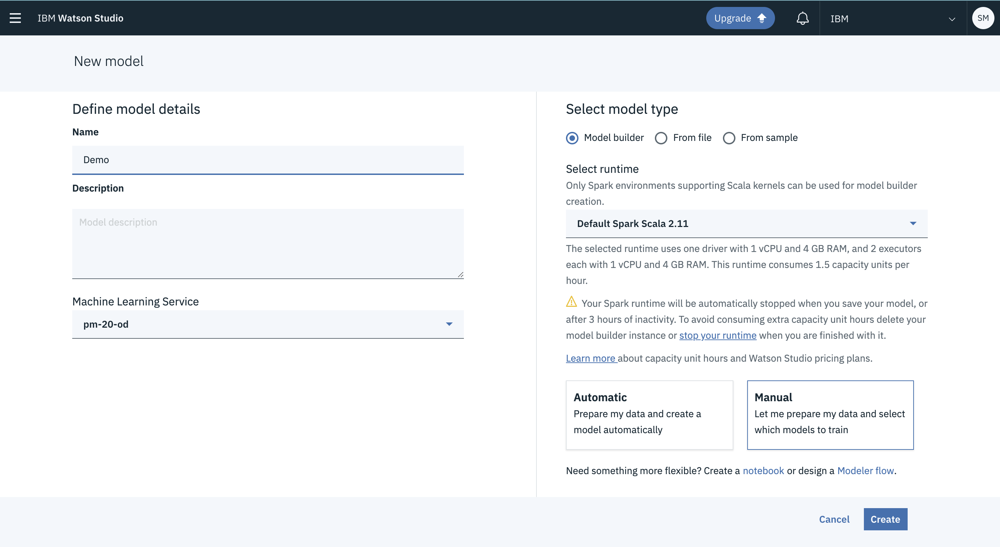
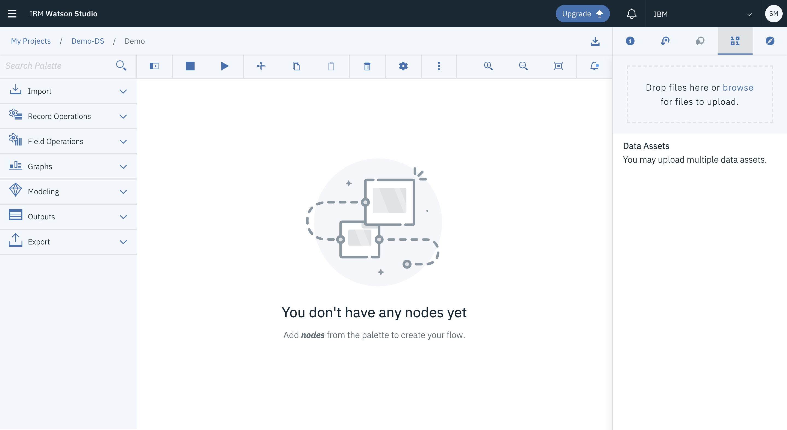
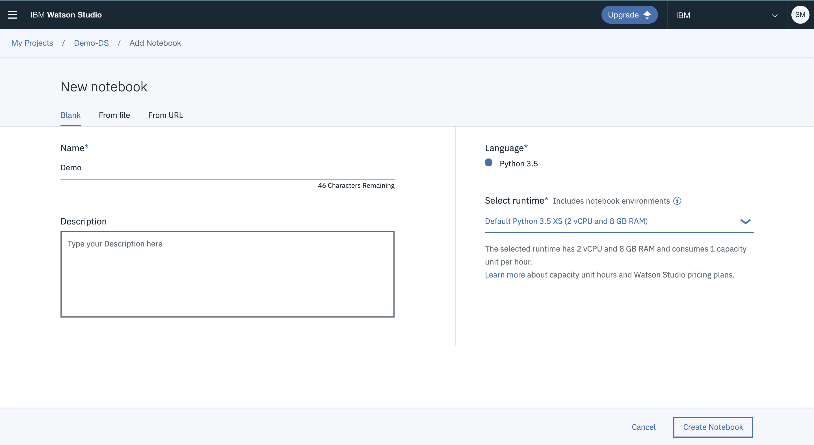

# Exploring Machine Learning with Watson Studio

Machine Learning is the baseline for domains like Data Science and Artificial Intelligence. The enormous amount of data generated every day reiterates on the need of an automated approach towards dealing with data.

Watson Studio is one stop platform for all problems pertaining to data. It contains environment or tools where data can be accessed and processed collaboratively. In Watson Studio, there are three ways to develop Machine Learning models:
1.	Machine Learning Model Builder
2.	SPSS Modeler Flow
3.	Jupyter Notebook

To get started with Machine Learning Model Builder, all you need to do after making a project in Watson Studio is click on “Add to Project”, add Watson Machine Learning Instance and click on “Model Builder” as option while selecting model type. You can select details for your model like:

1.	predicting column, 
2.	input column, 
3.	the algorithm, 
4.	the estimator and 
5.	the data split. 

This limits the coding expertise needed by user. One can also run multiple algorithms which then appear along with metrics. The model with most appropriate metrics can then be chosen.

  

For SPSS Modeler Flow, you need to add “Modeler Flow” from “Add to Project”. It allows you to choose from wide variety of Machine Learning algorithms which are present as drag and drop icons. Wide variety of data preparation techniques are also available along with evaluation and statistics nodes, which can be connected to the classifiers for determining if it is working fine.

  

Watson Studio can also be used to develop Jupyter Notebooks, where users interested in programming can code the machine learning models conventionally. This option is further utilized for programming in Python from scratch, or use Scikit-learn library for Machine Learning models. IBM cloud further gives you the chance to import your own notebooks from local systems, or can fetch one from a URL.

  

To sum up in a nutshell, Watson Studio is a greatly effective tool for developing machine learning models. You don’t need to be programmatically sound in Python or R to start working on these models. Watson Studio intends to accommodate the ideas, and users with different level of expertise.

To follow up on Machine Learning on Watson Studio, here is the link to the step by step recipe on developer.ibm.com: https://developer.ibm.com/recipes/tutorials/a-case-study-in-using-ibm-watson-studio-machine-learning-services/#r_ingredients
